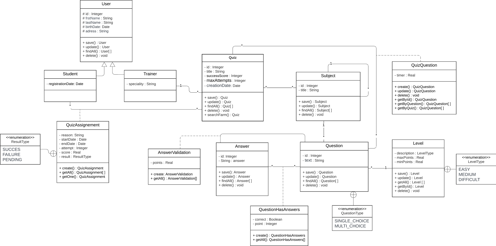

# 🧑‍💻 YouQuiz - Automated Quiz and Exam Management Platform
     


Welcome to **YouQuiz**, your ultimate solution for automating quiz and exam workflows. Designed to cater to the needs of educators and institutions, YouQuiz offers a seamless and efficient way to manage assessments.

---

## 📑 Table of Contents

1. [Project Overview](#-project-overview)
2. [Core Features](#-core-features)
3. [Technology Stack](#-technology-stack)
4. [Project Structure](#-project-structure)
5. [Setup and Installation](#-setup-and-installation)
7. [Evaluation Criteria](#-evaluation-criteria)
8. [Endpoints](#-endpoints)
9. [Contributing](#-contributing)

---

## 📋 Project Overview

**YouQuiz** is a feature-rich platform for automating quiz and exam workflows. It streamlines the creation, administration, and evaluation of assessments while accommodating diverse roles such as trainers, students, and administrators.

---

## 🌟 Core Features

### Functional Highlights
- **Test and Question Management**:
    - Multiple subjects, hierarchical sub-topics, media support (images, videos).
    - Configurable test rules: success score, attempts allowed, etc.
- **Student and Trainer Features**:
    - Multiple test attempts for students with approval.
    - Scheduling and performance tracking.

### Technical Requirements
- **Spring Boot** for scalable backend development.
- **PostgreSQL** for relational database storage.
- Comprehensive testing with **JUnit** and **Mockito**.

---

## 💻 Technology Stack

- **Backend**: Spring Boot, Spring Data JPA, Spring Core, Spring Web
- **Database**: PostgreSQL
- **Testing**: JUnit, Mockito

---

## 🗂️ Project Structure

```plaintext
src
├── main
│   ├── java/org/youcode/youquiz
│   │   ├── config          # Configuration classes
│   │   ├── controllers     # REST Controllers
│   │   ├── entities        # Entity models (User, Trainer, Student, Test, etc.)
│   │   ├── repositories    # Spring Data JPA Repositories
│   │   ├── services        # Business logic services
│   │   └── utils           # Utility and helper classes
│   └── resources
│       ├── application.properties # Database and app configuration
└── test
    └── java/org/youcode/youquiz    # Unit and integration tests
```

---

## ⚙️ Setup and Installation

### Prerequisites
- **Java 17** or later
- **Maven 3.8+**
- **PostgreSQL**

### Steps
1. Clone the repository:
   ```bash
   git clone https://github.com/J-Maryam/YouQuiz.git
   cd youquiz
   ```
2. Configure the database in `application.properties`:
   ```properties
   spring.datasource.url=jdbc:postgresql://localhost:5432/youquiz_db
   spring.datasource.username=your_username
   spring.datasource.password=your_password
   ```
3. Build and run the application:
   ```bash
   mvn clean install
   mvn spring-boot:run
   ```

---

## 📈 Class diagram (UML)


---

## 🏆 Evaluation Criteria

1. **Architecture**: Cleanly layered (Controller, Service, Repository).
2. **Code Quality**: Naming conventions, exception handling, and validation.
3. **Adherence to SOLID** principles.
4. **Testing**: Demonstration of critical application tests.
5. **Presentation**: Clear explanation of the architecture, code, and workflows.

---

## 🔗 Endpoints

| **Endpoint**               | **Description**                         | **Method** |
|----------------------------|-----------------------------------------|------------|
| `/api/trainers`            | Manage trainers                        | POST/GET   |
| `/api/students`            | Manage students                        | POST/GET   |
| `/api/tests`               | CRUD operations for tests              | POST/GET   |
| `/api/questions`           | CRUD operations for questions          | POST/GET   |

---

### 🎉 Let's Build Something Amazing Together!
